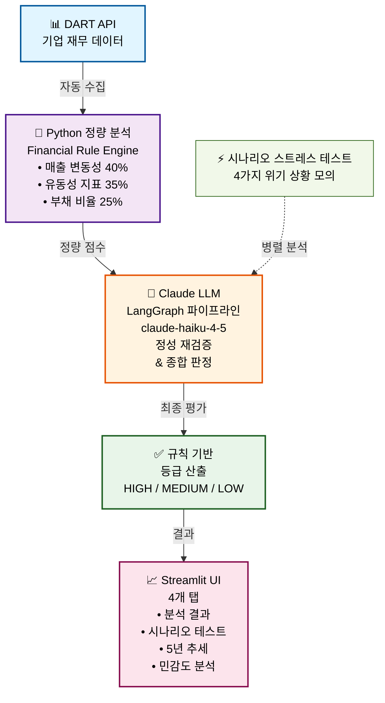
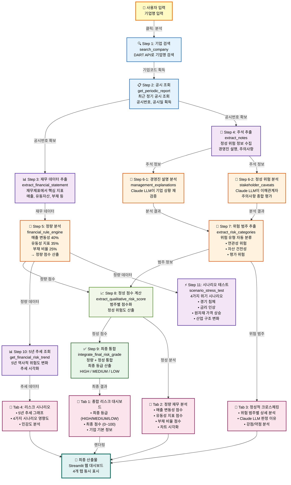

# AI 기반 기업 정량·정성 복합 리스크 검증 시스템

AI를 활용한 기업 리스크 평가 시스템으로, **정량 분석 + 정성 검증 + 시나리오 테스트**를 통해 종합적인 기업 신용등급을 산출합니다.

---

## 🏗️ 기술 아키텍처 (고수준)



---

## 🔄 상세 데이터 플로우 (기업명 입력 → 최종 산출)



---

## 📋 파일 구조

```
ai-individual-project/
├── app.py                          # Streamlit UI (메인)
├── analyzer_pipeline.py            # LangGraph 분석 엔진
├── sensitivity_analysis.py         # 민감도 분석
├── qualitative_weight_sensitivity.py  # 가중치 변동 분석
├── dart_test.py                    # DART API 테스트
├── requirements.txt                # 의존성
├── .env                            # API 키 (절대 커밋 금지)
└── docs_cache/                     # 캐시 데이터
```

---

## 🛠️ 기술 스택

| 영역 | 기술 |
|------|------|
| **언어** | Python 3.11 |
| **데이터 수집** | DART-FSS API, pandas, NumPy |
| **AI/LLM** | Claude API (claude-haiku-4-5-20251001), LangGraph |
| **분석 엔진** | Financial Rule Engine (정량) |
| **UI/UX** | Streamlit, Plotly (차트) |
| **환경 관리** | python-dotenv |

---

## 🚀 빠른 시작

### 1️⃣ 환경 설정
```bash
pip install -r requirements.txt
```

### 2️⃣ 환경 변수 설정
`.env` 파일을 생성하고 다음을 추가:
```env
ANTHROPIC_API_KEY=your_api_key_here
DART_API_KEY=your_dart_key_here
```

### 3️⃣ 앱 실행
```bash
streamlit run app.py
```

---

## 📊 주요 기능

### 1. **정량 분석 (Financial Rule Engine)**
- 매출 변동성: 기업의 매출 안정성 평가
- 유동성 지표: 단기 상환 능력 평가
- 부채 비율: 장기 재무 건전성 평가

### 2. **정성 검증 (Claude LLM)**
- 정량 점수의 합리성 재검증
- 업계 특수성 고려
- 최종 등급 판정 (HIGH/MEDIUM/LOW)

### 3. **시나리오 스트레스 테스트**
- 4가지 위기 상황 모의 (경기 침체, 금리 인상, 원자재 가격 상승, 산업 구조 변화)
- 각 시나리오에서의 리스크 등급 변화 분석

### 4. **대시보드 & 시각화**
- 📌 분석 결과: 종합 리스크 등급 및 상세 점수
- 📊 5년 추세: 기업의 역사적 리스크 변화
- ⚡ 시나리오 분석: 위기 상황별 리스크 변화
- 🎚️ 민감도 분석: 가중치 변동에 따른 영향도

---

## 💡 아키텍처 설계 원리

왜 **코드 + LLM 하이브리드** 방식을 사용하는가?

> **정확도 관점:**
> - AI가 모든 단계를 처리: 90% × 90% × 90% × 90% × 90% = **59% 정확도**
> - 코드(결정론적) + AI(판단): **85%+ 정확도**

**우리의 접근:**
- ✅ **Python 스크립트**: DART API 호출, 재무 지표 계산 (반복 가능, 결정론적)
- ✅ **Claude LLM**: 정성 검증, 판단, 최종 평가 (창의성 필요)
- ✅ **규칙 기반 엔진**: 최종 등급 산출 (투명한 로직)

---

## 📈 프로젝트 진행 상황

| 주차 | 목표 | 상태 |
|------|------|------|
| 1주차 | 환경 설정 + DART API 연결 | ✅ 완료 |
| 2주차 | 정량 분석 + 가중치 통합 | ✅ 완료 |
| 3주차 | 정성 검증 + 최종 등급 | ✅ 완료 |
| 4주차 | 시나리오 분석 + 5년 추세 + UI 완성 | ✅ 완료 (95%) |

---

## ⚠️ 핵심 규칙

1. **API 키 하드코딩 금지** → `.env`에서만 로드
2. **모델 고정** → `claude-haiku-4-5-20251001`만 사용
3. **세션 캐싱** → 데이터 휘발 방지
4. **마크다운 렌더링** → `st.markdown()` 사용 (st.html() 금지)
5. **언어 규칙** → UI는 한국어, 코드는 영어 snake_case

---

## 📞 문의

프로젝트 관련 질문이나 개선 사항은 CLAUDE.md를 참고하세요.

---

**Last Updated: 2026-06-29**